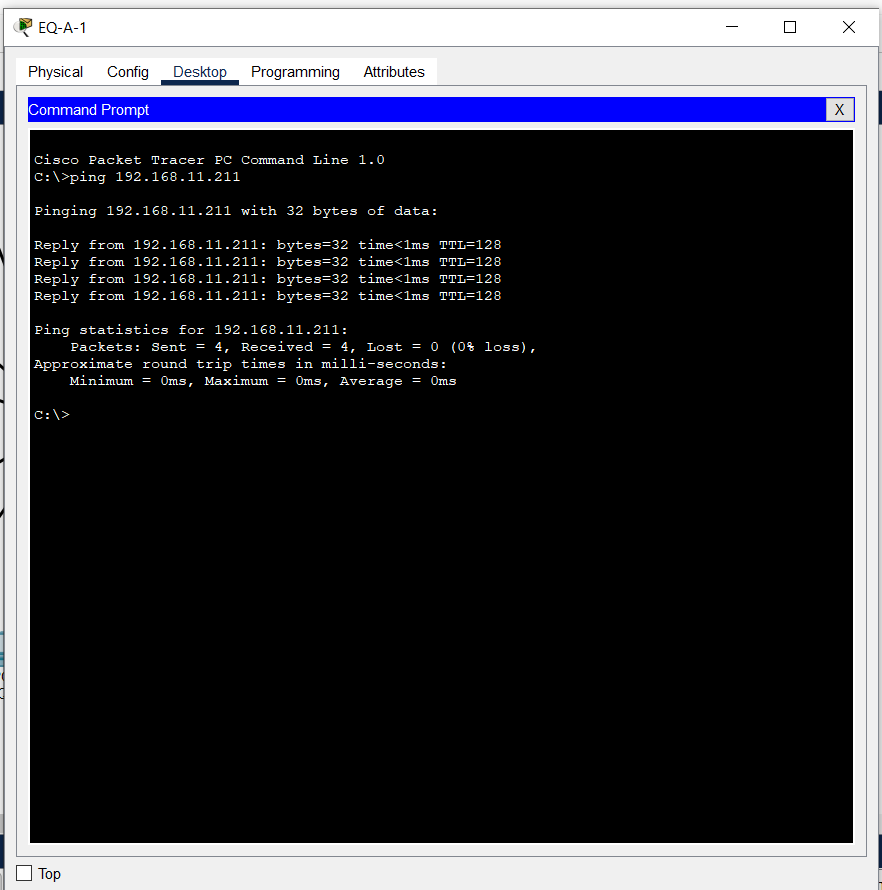

## Nivel 2️⃣

### Configuración de las VPCS

* Configuración del Primer Equipo de la **oficina A**

* Configuración del Primer Equipo de la **oficina B**

* Configuración del Primer Equipo de la **oficina C**

### Uso del Comando Ping
* Ping del Equipo 1 de la oficina A `192.168.11.21` al equipo 2 de la oficina C `192.168.11.211`

* Ping del Equipo 4 de la oficina B `192.168.11.27` al equipo 2 de la oficina A `192.168.11.22`

