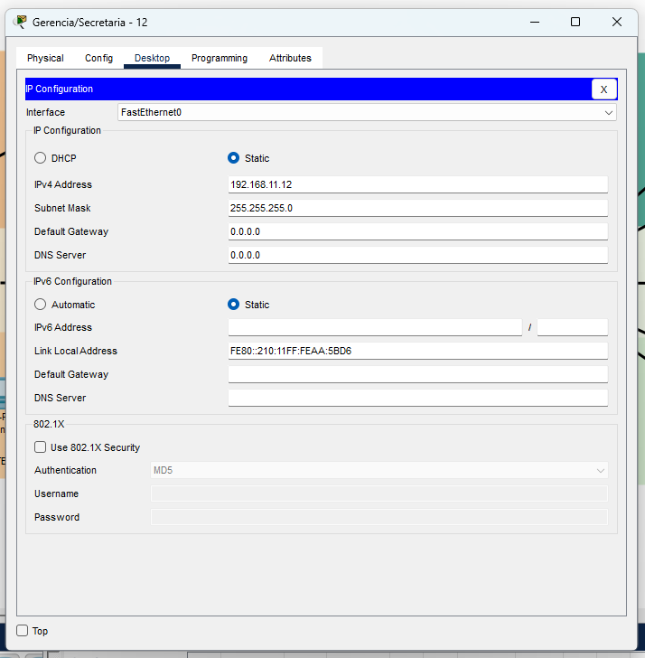
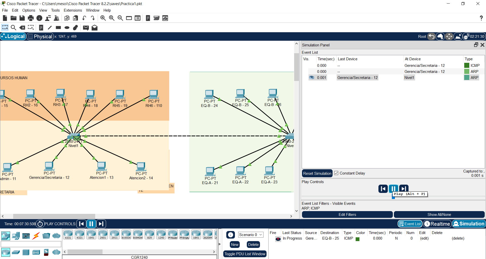

## **Configuración de las VPCS**
### Nivel :one:

* Configuración del Equipo de **Administración**

* Configuración del Equipo de **Gerencia/Secretaría**

* Configuración del Primer Equipo de **Atención al Cliente**

* Configuración del Primer Equipo de **Recursos Humanos**

### Nivel :two:

* Configuración del Primer Equipo de la **oficina A**

* Configuración del Primer Equipo de la **oficina B**

* Configuración del Primer Equipo de la **oficina C**

### Nivel :three:

* Configuración del Equipo de **Recepción**

* Configuración del Primer Equipo de la **Oficina IT**

* Configuración del Equipo de **Ventas**

### Uso del Comando Ping
* Ping del Equipo 1 de la oficina A `192.168.11.21` al equipo 2 de la oficina C `192.168.11.211`

* Ping del Equipo 4 de la oficina B `192.168.11.27` al equipo 2 de la oficina A `192.168.11.22`

* Ping del Equipo de Administracion `192.168.11.11` al primer equipo de la oficina de IT `192.168.11.32`

* Ping del Equipo 1 de la oficina C `192.168.11.210` al equipo de ventas `192.168.11.35`

* Ping del Equipo de Recepción `192.168.11.31` al equipo 1 de Recursos Humanos `192.168.11.15`

* Envío de Paquetes *ARP/ICMP*

