<h1 align="center">Proyecto 1</h1>

👨‍👨‍👦 Grupo 10

📕 REDES DE COMPUTADORAS 1

 🏛 Universidad San Carlos de Guatemala

 📆 Segundo Semestre 2024

 

# 📍 Manual Técnico

## 📋 Resumen de direcciones IP y VLANS

* *Area Administrativa*

| *Equipo*      | *IP*         | *Mascara de Subred* | *Puertos*     | *VLAN* |
| ------------- | ------------ | ------------------- | ------------- | ------ |
| RRHH          | 192.168.11.0 | 255.255.255.0       | Hacia S6      | 11     |
| RRHH3         | 192.168.11.3 | 255.255.255.0       | Hacia Switch0 | 11     |
| SECRETARIA    | 192.168.21.4 | 255.255.255.0       | Hacia S3      | 21     |
| CONTABILIDAD2 | 192.168.31.2 | 255.255.255.0       | Hacia S6      | 31     |
| IT_2          | 192.168.41.4 | 255.255.255.0       | Hacia S4      | 41     |
| IT_3          | 192.168.41.3 | 255.255.255.0       | Hacia Switch0 | 41     |

* *Area Central*

| *Equipo*     | *IP*         | *Mascara de Subred* | *Puertos*     | *VLAN* |
| ------------ | ------------ | ------------------- | ------------- | ------ |
| S_RRHH       | 192.168.11.5 | 255.255.255.0       | Hacia S2      | 11     |
| SECRETARIA1  | 192.168.21.3 | 255.255.255.0       | Hacia Switch1 | 21     |
| CONTABILIDAD | 192.168.31.5 | 255.255.255.0       | Hacia S2      | 31     |
| IT           | 192.168.41.5 | 255.255.255.0       | Hacia S1      | 41     |

* *Oficina A*

| *Equipo*      | *IP*         | *Mascara de Subred* | *Puertos*     | *VLAN* |
| ------------- | ------------ | ------------------- | ------------- | ------ |
| CONTABILIDAD1 | 192.168.31.1 | 255.255.255.0       | Hacia Switch7 | 31     |
| IT_1          | 192.168.41.1 | 255.255.255.0       | Hacia Switch7 | 41     |
| SECRETARIA1   | 192.168.21.1 | 255.255.255.0       | Hacia Switch7 | 21     |
| SECRETARIA2   | 192.168.21.2 | 255.255.255.0       | Hacia Switch8 | 21     |
| RRHH1         | 192.168.11.1 | 255.255.255.0       | Hacia Switch8 | 11     |
| RRHH2         | 192.168.11.2 | 255.255.255.0       | Hacia Switch8 | 11     |

 

## 📷 Capturas de la implementación de la topología

* *Area Administrativa*
  

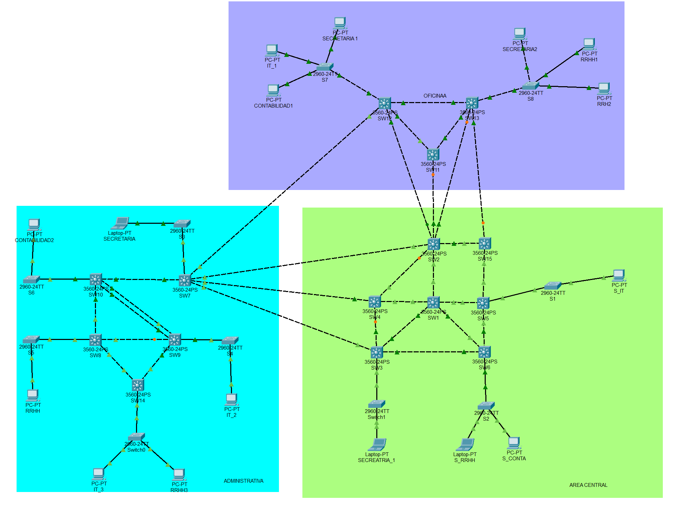

* *Configuración*

* Configuracion de Ip's
  * VLAN 11
  

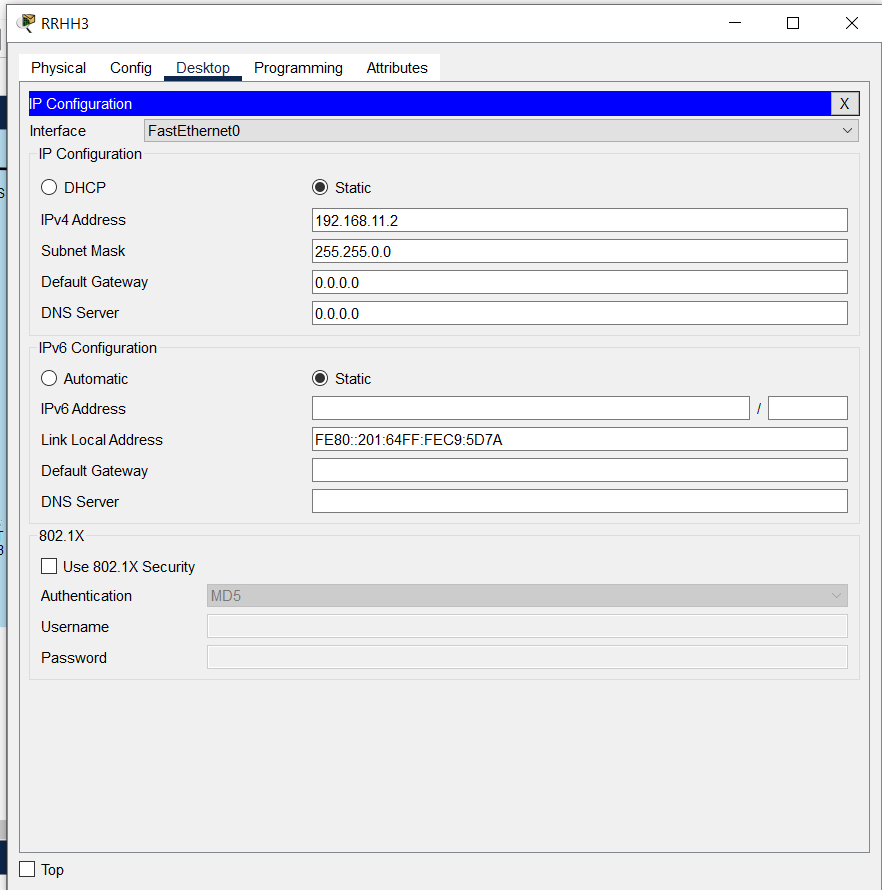

  * VLAN 21
  

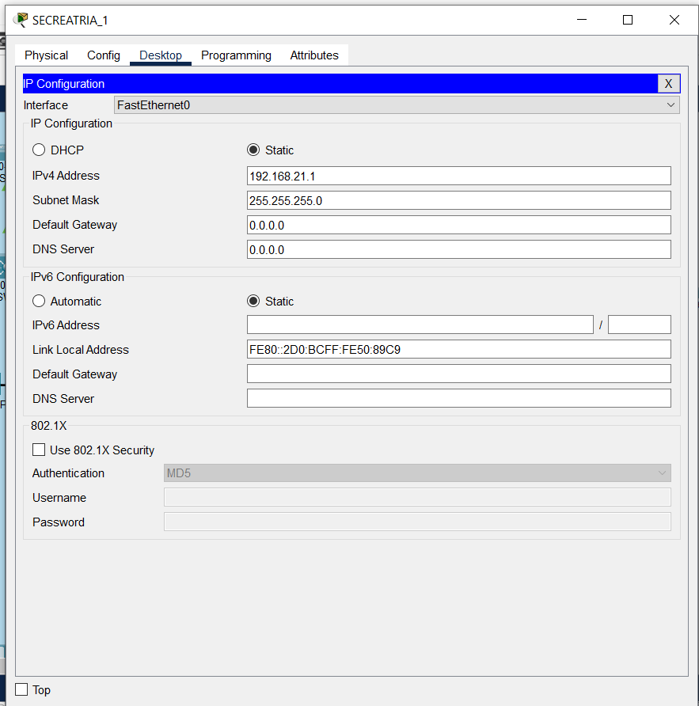

  * VLAN 31
  
  

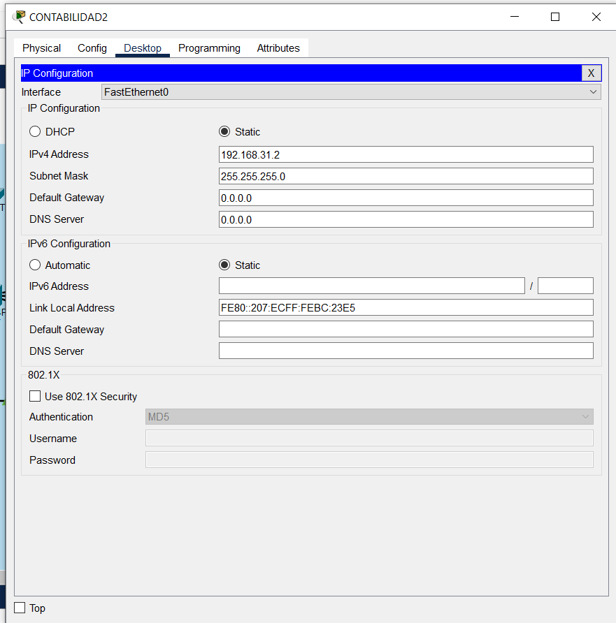

  * VLAN 41
   

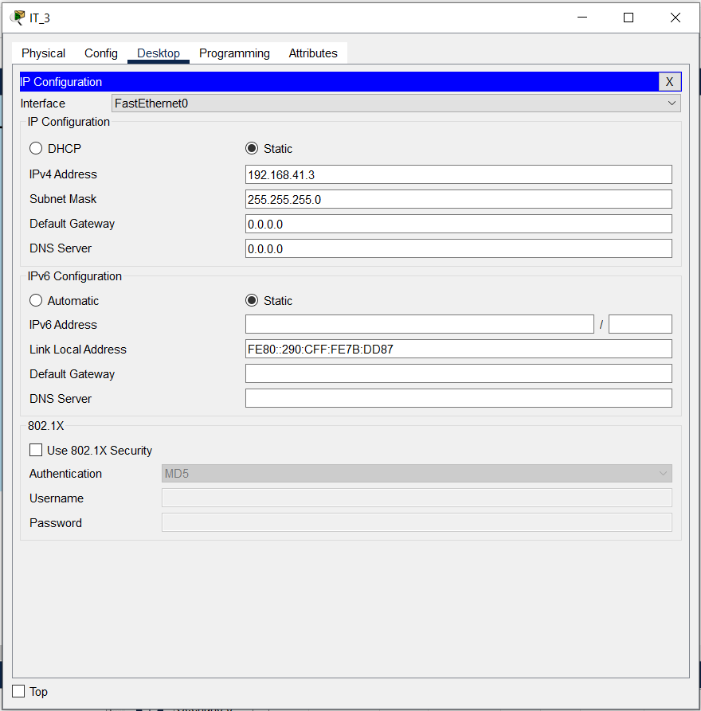

* Configuración del Switch en modo Servidor

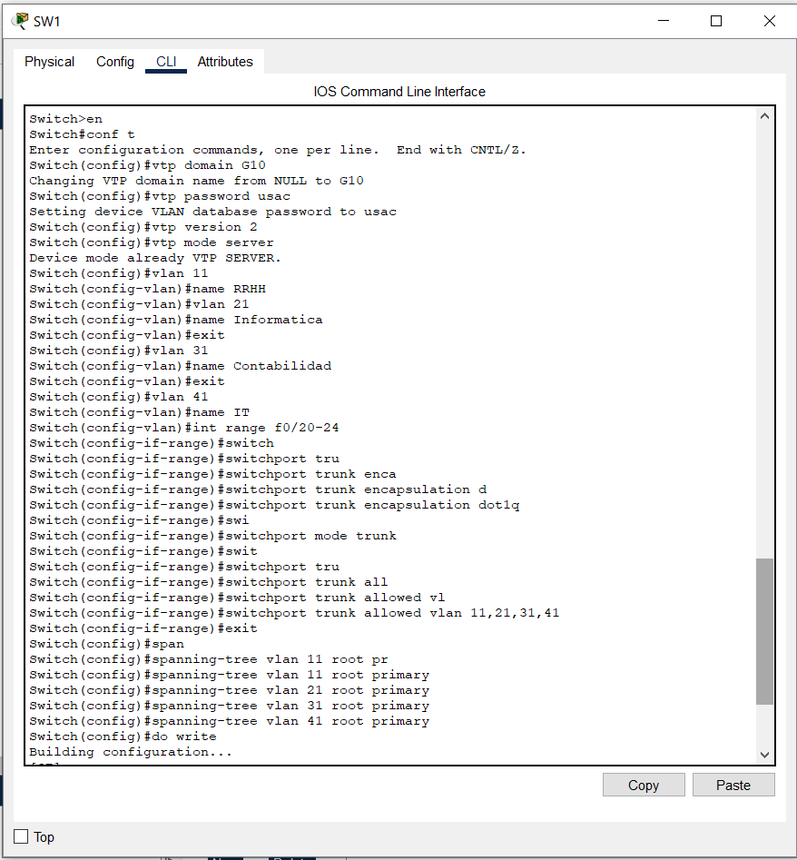

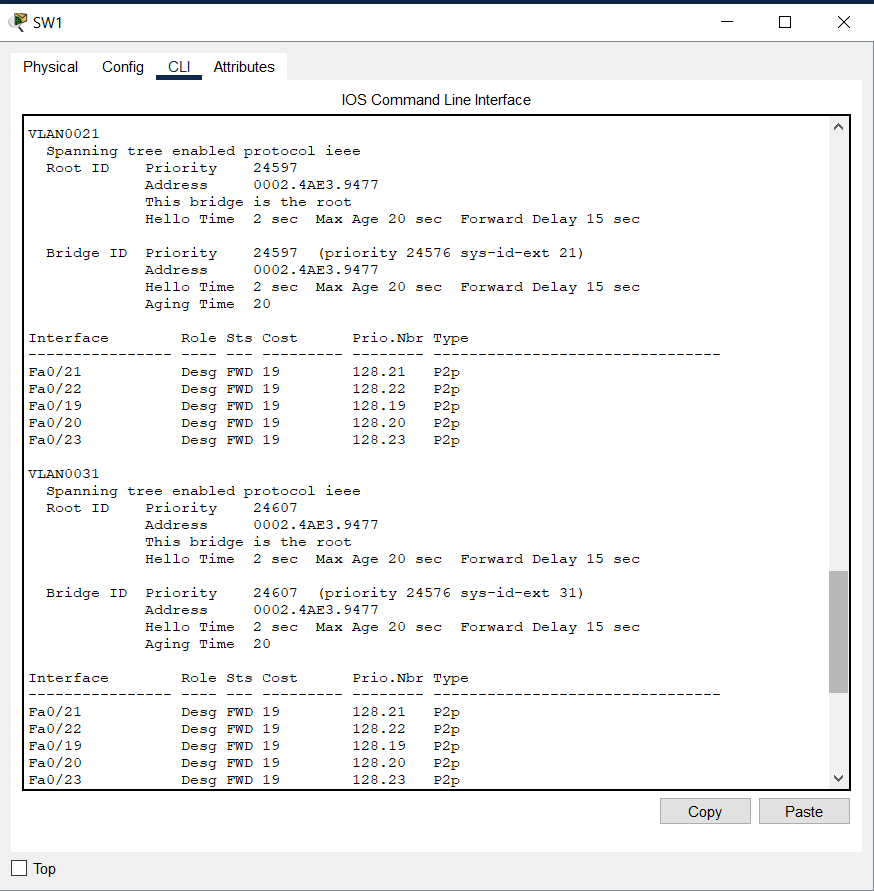

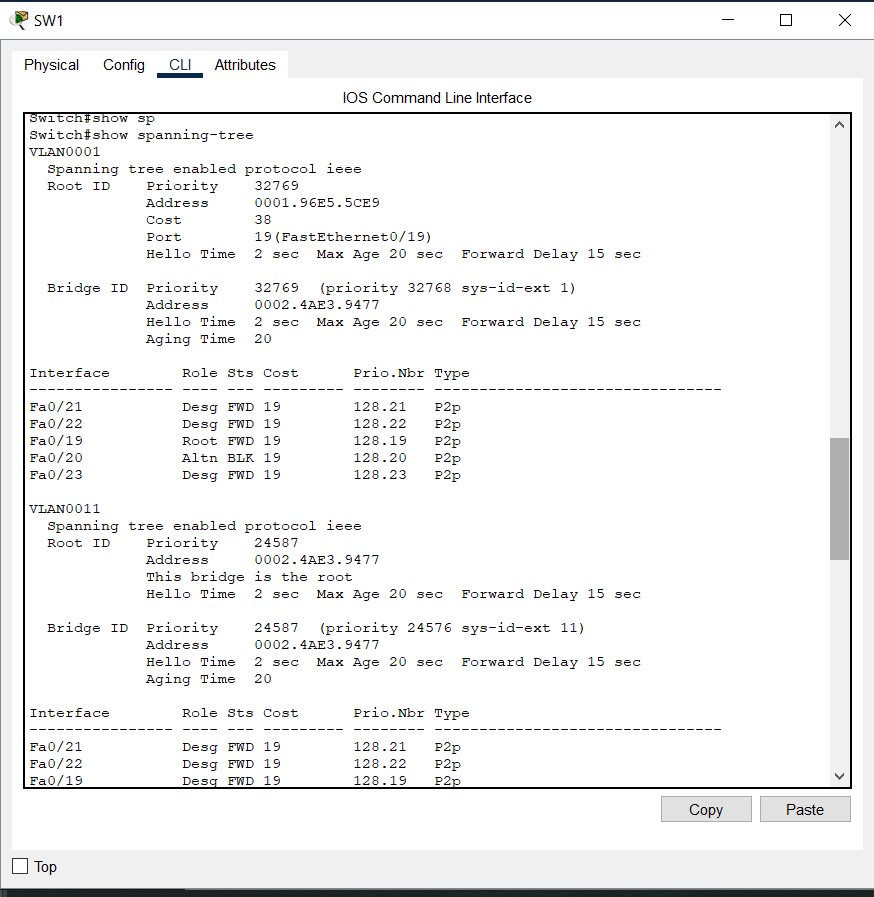

* Configuración de los Switches en modo Cliente

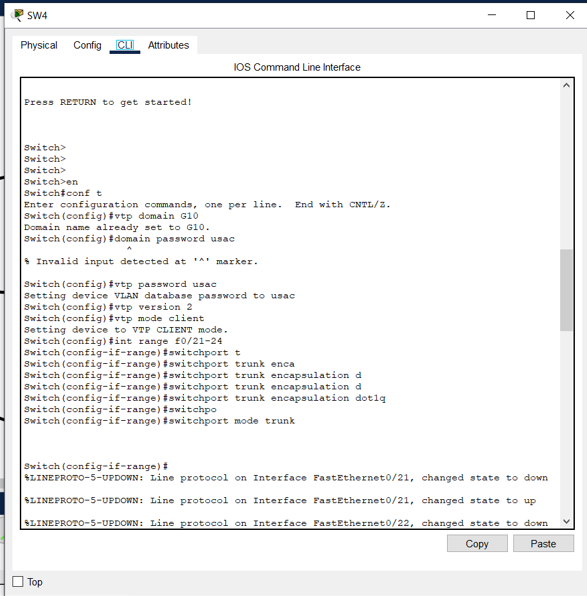

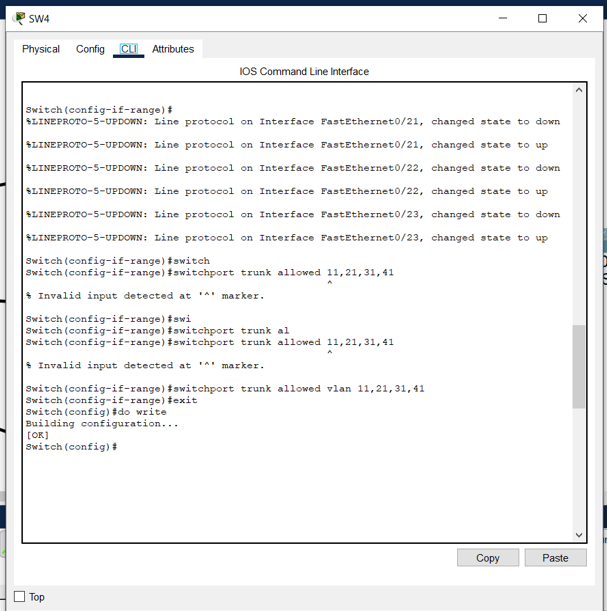

## 💻 Detalle de comandos usados

| *Comando*                                   | *Descripción*                                                                                                 |
| ------------------------------------------- | ------------------------------------------------------------------------------------------------------------- |
| `en`                                        | Activa el modo privilegiado (enable).                                                                         |
| `conf t`                                    | Entra al modo de configuración global.                                                                        |
| `vtp domain G10`                            | Configura el dominio VTP como G10.                                                                            |
| `vtp password usac`                         | Establece la contraseña VTP como usac.                                                                        |
| `vtp version 2`                             | Configura la versión 2 de VTP.                                                                                |
| `vtp mode client`                           | Configura el switch en modo cliente VTP.                                                                      |
| `int f0/22`                                 | Selecciona la interfaz FastEthernet 0/22 para configuración.                                                  |
| `int range f0/20-23`                        | Selecciona un rango de interfaces para configurar simultáneamente.                                            |
| `switchport mode trunk`                     | Intenta configurar la interfaz en modo trunk, pero es rechazado debido a que la encapsulación está en "Auto". |
| `switchport trunk encapsulation dot1q`      | Cambia la encapsulación de la interfaz a dot1q, permitiendo la configuración en modo trunk.                   |
| `switchport mode trunk`                     | Configura la interfaz en modo trunk después de ajustar la encapsulación.                                      |
| `switchport trunk allowed vlan 11,21,31,41` | Permite solo las VLANs 11, 21, 31 y 41 en el trunk.                                                           |
| `do write`                                  | Guarda la configuración en la memoria startup-config.                                                         |
| `exit`                                      | Sale del modo de configuración de interfaz o global.                                                          |
| `show vtp status`                           | Muestra el estado de configuración del Protocolo VTP (Versión, Dominio, Modo, etc.).                          |
| `show vlan`                                 | Muestra las VLANs existentes y los puertos asignados a cada una.                                              |

## 🌍 Ping entre hosts

* Ping entre el equipo RRHH3 y RRHH

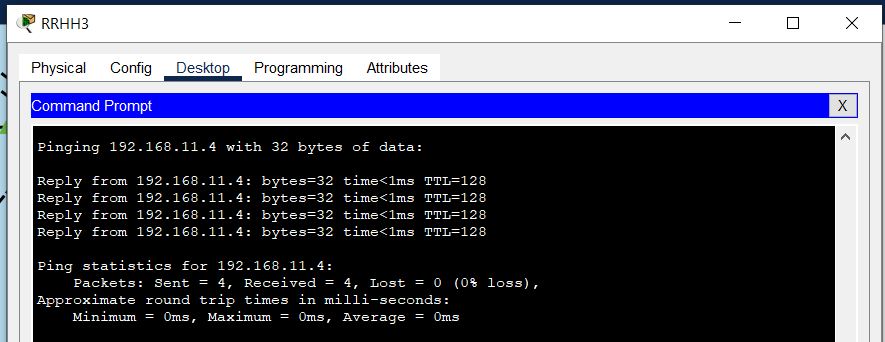

* Ping entre el equipo CONTABILIDAD2 y S_CONTA

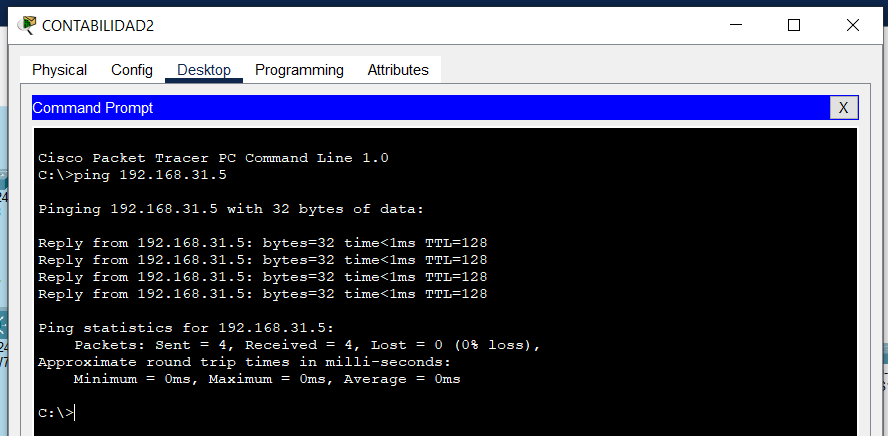

## [Presupuesto](Presupuesto.pdf)
