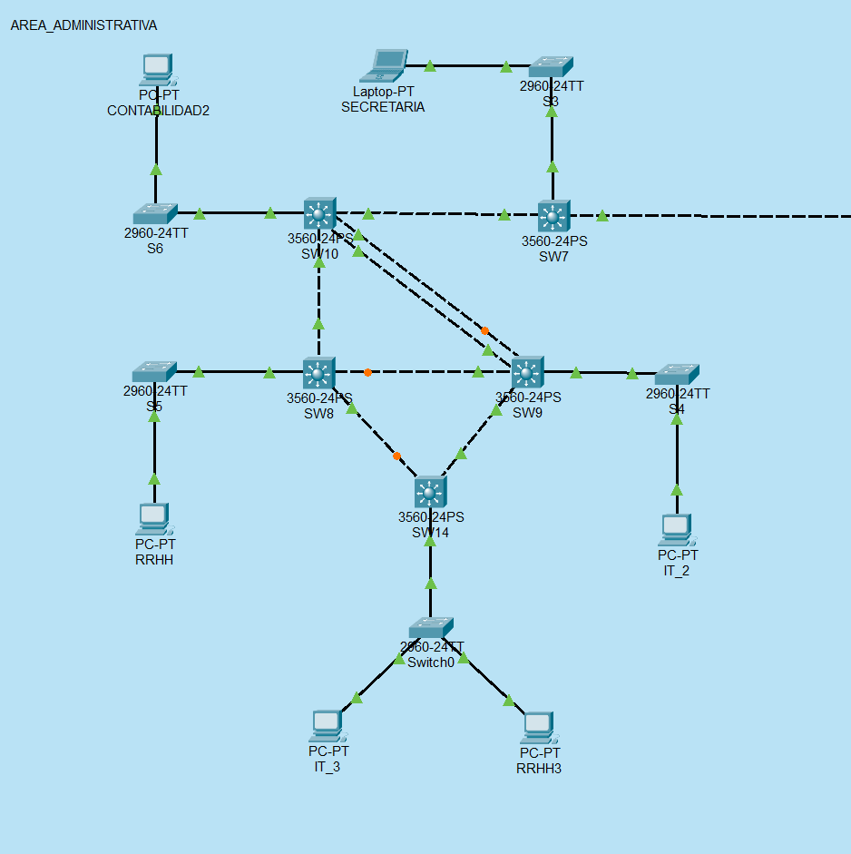

<h1 align="center">Proyecto 1</h1>

👨‍👨‍👦 Grupo 10

📕 REDES DE COMPUTADORAS 1

 🏛 Universidad San Carlos de Guatemala

 📆 Segundo Semestre 2024

 

# 📍 Manual Técnico

## 📋 Resumen de direcciones IP y VLANS

* **Area Administrativa**

| **Equipo**    | **IP**       | **Mascara de Subred** | **Puertos**   | **VLAN** |
| ------------- | ------------ | --------------------- | ------------- | -------- |
| RRHH          | 192.168.11.4 | 255.255.255.0         | Hacia S6      | 11       |
| RRHH3         | 192.168.11.2 | 255.255.255.0         | Hacia Switch0 | 11       |
| SECRETARIA    | 192.168.21.4 | 255.255.255.0         | Hacia S3      | 21       |
| CONTABILIDAD2 | 192.168.31.2 | 255.255.255.0         | Hacia S6      | 31       |
| IT_2          | 192.168.41.4 | 255.255.255.0         | Hacia S4      | 41       |
| IT_3          | 192.168.41.3 | 255.255.255.0         | Hacia Switch0 | 41       |

 

## 📷 Capturas de la implementación de la topología

* **Area Administrativa**
  

## 💻 Detalle de comandos usados

| **Comando**                            | **Descripción**                                                                                               |
| -------------------------------------- | ------------------------------------------------------------------------------------------------------------- |
| `en`                                   | Activa el modo privilegiado (`enable`).                                                                       |
| `conf t`                               | Entra al modo de configuración global.                                                                        |
| `vtp domain G10`                       | Configura el dominio VTP como `G10`.                                                                          |
| `vtp password usac`                    | Establece la contraseña VTP como `usac`.                                                                      |
| `vtp version 2`                        | Configura la versión 2 de VTP.                                                                                |
| `vtp mode client`                      | Configura el switch en modo cliente VTP.                                                                      |
| `int f0/22`                            | Selecciona la interfaz `FastEthernet 0/22` para configuración.                                                |
| `switchport mode trunk`                | Intenta configurar la interfaz en modo trunk, pero es rechazado debido a que la encapsulación está en "Auto". |
| `switchport trunk encapsulation dot1q` | Cambia la encapsulación de la interfaz a `dot1q`, permitiendo la configuración en modo trunk.                 |
| `switchport mode trunk`                | Configura la interfaz en modo trunk después de ajustar la encapsulación.                                      |
| `do w`                                 | Guarda la configuración en la memoria `startup-config`.                                                       |
| `exit`                                 | Sale del modo de configuración de interfaz.                                                                   |
| `show vlan`                            | Muestra las VLANs existentes y los puertos asignados a cada una.                                              |

## 🌍 Ping entre hosts

* Ping entre el equipo RRHH3 y RRHH

